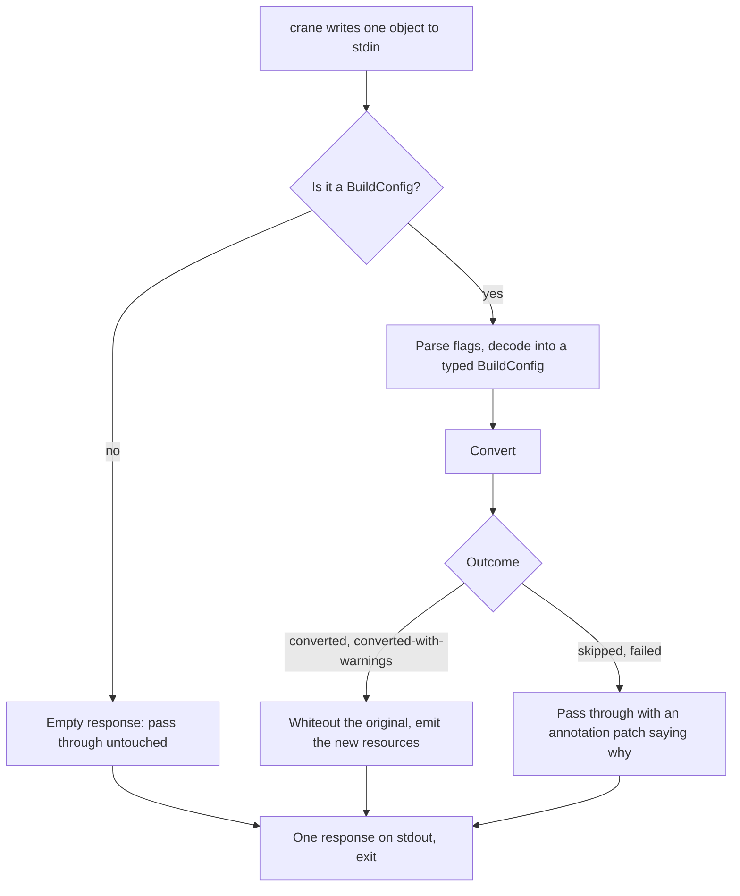
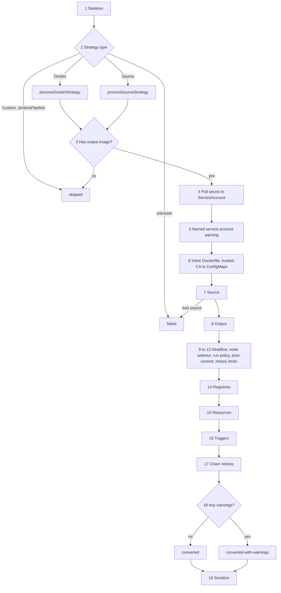

# Architecture

This page is for people and agents who change the plugin. It explains what happens to a
BuildConfig inside the plugin, which parts of the code are risky to touch, and which rules
must stay true. Read it before editing anything under `buildconfig/`. If you run the tool
rather than change it, start with the README instead. A field-by-field support matrix is
on its way; see [Pending changes](#pending-changes).

Three tests in `buildconfig/` keep this page honest. See [What keeps this page true](#what-keeps-this-page-true).

Contents

1. [How the plugin runs](#how-the-plugin-runs)
2. [The conversion, step by step](#the-conversion-step-by-step)
3. [Steps that depend on each other](#steps-that-depend-on-each-other)
4. [Outcomes, and where they are recorded](#outcomes-and-where-they-are-recorded)
5. [What the plugin generates](#what-the-plugin-generates)
6. [The files, and how carefully to read a change to each](#the-files)
7. [Rules that must stay true](#rules-that-must-stay-true)
8. [Where to add things](#where-to-add-things)
9. [What keeps this page true](#what-keeps-this-page-true)

## How the plugin runs

The plugin is a separate program that crane starts once per resource. crane writes one
JSON object to the plugin's standard input, reads one JSON object back from standard
output, and the process exits. There is no loop inside the plugin. A migration with two
hundred BuildConfigs runs the plugin two hundred times.

`main.go` wires the plugin type into crane-lib's command-line harness. Everything else is
in the `buildconfig` package. The entry point is `Run` in `plugin.go`, and it does one of
three things:

- **The object is not a BuildConfig.** `Run` returns an empty response. crane passes the
  object through untouched. This is how every Deployment, Service and Secret in the export
  goes past this plugin.
- **The object is a BuildConfig and it converts.** `Run` returns "delete the original"
  (`IsWhiteOut`) plus the new resources (`NewResources`): one Shipwright Build and, when
  needed, a ServiceAccount and a ConfigMap.
- **The object is a BuildConfig and it does not convert.** `Run` returns a small JSON patch
  that adds two annotations to the original BuildConfig saying it was skipped or failed,
  and why. The BuildConfig stays in the migration output so an auditor can find it.

`Run` returns a Go error only for two problems that happen before conversion starts: the
object cannot be re-encoded, or it cannot be decoded as a BuildConfig. Flag parsing has an
error return as well, but `ParseOptionalFields` cannot fail today. crane treats any plugin
error as fatal for the whole run, so `Convert` itself never returns one. A BuildConfig that
cannot be converted is a `failed` outcome, not an error.

`Metadata` declares the six flags and `ParseOptionalFields` parses them, both in
`plugin.go`. `crane transform optionals` prints them. They are: `registry-mapping`,
`imagestream-mapping`, `default-build-strategy`, `search-registries`,
`insecure-registries`, `block-registries`.

## The conversion, step by step

`Convert` in `converter.go` builds one Shipwright Build from one BuildConfig. It walks the
BuildConfig field group by field group in a fixed order. At each step it writes what
Shipwright can express and records a warning for anything it drops. Seven steps can end
the conversion: two by design, the strategy switch in step 2 and the output gate in step 3,
and five more on an error. The rest only add to the Build or warn.

| # | Step | Function | Reads | Writes | Can end the conversion |
|---|---|---|---|---|---|
| 1 | Skeleton | inline in `Convert` | name, namespace, labels, annotations | a new Build with the same name (sanitized by `uniqueName`), the labels and annotations minus the OpenShift-managed ones that `filterMetadata` drops at INFO, and the `converted-from` annotation | no |
| 2 | Strategy | inline switch, then `processDockerStrategy` or `processSourceStrategy` | `spec.strategy` | strategy name (`buildah` or `source-to-image`, both strategy-catalog names, or the override from `default-build-strategy`), the strategy params, `spec.env`, `spec.volumes` | Custom and JenkinsPipeline: skipped. Unknown type: failed. A `from` image that cannot be resolved: failed |
| 3 | Output-image gate | inline in `Convert` | `spec.output.to` | nothing | Missing or empty: skipped. Shipwright requires an output image |
| 4 | Pull secret | inline, `getPullSecret`, `generateServiceAccount` | the strategy's `pullSecret`, `spec.serviceAccount` | a new ServiceAccount carrying the secret, only when the BuildConfig names no service account | serialization error: failed |
| 5 | Named service account | inline in `Convert` | `spec.serviceAccount` | nothing on the Build; step 15 writes the name into the BuildRun template. Warns W9 that crane carries the account, its RoleBindings and the cluster RBAC that names it, and what to check, or W72 when the name is `builder`, `deployer` or `default`, which the migration may not carry over: crane-lib's KubernetesPlugin drops `default`, and crane-plugin-openshift drops the other two, but only when it runs. `crane transform` runs every installed plugin only when no stages are named, and the README names two, so being installed decides nothing. W72 says to check the target for the account and makes the remedy depend on the answer | no |
| 6 | Inline Dockerfile, trusted CA | `processInlineDockerfile` in `dockerfile.go`, then `processMountTrustedCA` | `spec.source.dockerfile`, `spec.mountTrustedCA`, the strategy volumes | Docker strategy: a ConfigMap holding the Dockerfile, plus a pointer annotation on the Build. Source strategy: dropped with a warning. `mountTrustedCA: true`: a `trusted-ca` entry in `spec.volumes` and a ConfigMap named after the BuildConfig plus `-trusted-ca-migrated`, labelled for the Cluster Network Operator to fill, unless the BuildConfig already declares a strategy volume by that name | serialization error: failed |
| 7 | Source | `processSource`, `processGitProxyConfig` | `spec.source` | `spec.source` as Git, Local (either binary form; the build is then started with `shp build upload`) or OCIArtifact (one image); `contextDir`; proxy env vars | more than one source type, more than one image, or a bad image reference: failed |
| 8 | Output | `processOutput`, `processOutputImageLabels` | `spec.output` and the two mapping flags | `spec.output.image`, `pushSecret`, `labels` | no |
| 9 | Completion deadline | `processCompletionDeadline` | `completionDeadlineSeconds` | `spec.timeout`; out-of-range values are dropped | no |
| 10 | Node selector | `processNodeSelector` | `nodeSelector` | `spec.nodeSelector`; if any key is invalid the whole map is dropped | no |
| 11 | Run policy | `processRunPolicy` | `runPolicy` | nothing; warns for Serial, which is also what an absent `runPolicy` means, for SerialLatestOnly, and for any unrecognised value. Parallel is the only silent case | no |
| 12 | Post-commit hook | `processPostCommit` in `postcommit.go` | `postCommit` | nothing; warns that the hook is dropped | no |
| 13 | History limits | `processBuildsHistoryLimits` | the two history limits | `spec.retention`; values outside 1 to 10000 are dropped | no |
| 14 | Registries | `addRegistries` | the three registry flags | strategy params for search, insecure and block lists. When the strategy name is exactly `source-to-image`, and only when the output image's registry is in the insecure list, the list sets `spec.output.insecure` instead, because Shipwright does the push there. An S2I override from `default-build-strategy` gets the `registries-insecure` param like buildah does, since the plugin cannot know how it pushes | no |
| 15 | Resources | `processResources` | `spec.resources`, and the account from steps 4 and 5 | a BuildRun template stored as an annotation, written when `spec.resources` has requests or limits or there is an account to name. Never a live BuildRun. Under a `default-build-strategy` override with resources the template has no `stepResources`, and a warning asks the user to add them; an account-only template raises no such warning, because there are no resources to place. With a Local source the template cannot start the Build at all, and the warning says to pass the account to `shp build upload` instead, adding the step-resources sentence only when resources were set | template cannot be marshalled: failed |
| 16 | Triggers | `processTriggers` in `triggers.go` | `spec.triggers` | the original triggers as an annotation, secrets removed; one warning per trigger and one summary | no |
| 17 | Chain notices | `processChainCandidates` in `chain.go` | the strategy `from`, `source.images[].from`, and the ImageChange triggers | nothing; one info line per `ImageStreamTag` input in the BuildConfig's own namespace that no warning already names, saying to run its producer first if there is one | no |
| 18 | Outcome | inline in `Convert` | the warnings recorded since step 1 | the `conversion-outcome` annotation, and the `conversion-warnings` annotation when any warning fired | no |
| 19 | Serialize | `toUnstructured`, `stripSerializationNoise` | the Build; the ServiceAccount and the ConfigMaps were serialized in steps 4 and 6 | the resources crane will write | conversion error: failed |

Every warning goes through one function, `warnf` in `outcome.go`. It prefixes the
message with the BuildConfig's namespace and name, appends it to the converter's list, and
logs it. One place logs at ERROR instead of WARN but still records through the same list:
an inline Dockerfile on a Docker strategy. The step 18 decision, the annotation on the
Build, and the `Warnings` field on the outcome all read that one list.

## Steps that depend on each other

Most steps only read the BuildConfig and write their own part of the Build, so their order
does not matter. Seven do depend on order:

| Later step | Needs from an earlier step |
|---|---|
| 6 Inline Dockerfile, trusted CA | the strategy name and the converted strategy volumes from step 2: the name decides whether W77 fires, and `spec.volumes` is checked for a `trusted-ca` volume before the mapping runs |
| 14 Registries | the strategy name from step 2, to decide between a param and `output.insecure`; the output image from step 8 |
| 15 Resources | the strategy name from step 2, to fill in step names; the generated ServiceAccount name from step 4, or the named account from step 5; the source type from step 7, to tell a Local source that the template cannot start it |
| 16 Triggers | the BuildRun-template annotation from step 15, which decides whether the ConfigChange warning points at the template or tells the operator to write a BuildRun by hand |
| 18 Outcome | every warning, so it must run after every other step |
| 19 Serialize | the annotations written in step 18 |
| 3 Output gate | must run before steps 4 to 19, which all assume an output image exists |

One ordering problem is left in the code. It is known and tracked, and it does not break
a build on the cluster.

- **Step 2 runs before the gate in step 3.** A BuildConfig with no output image goes
  through the whole strategy step, raises its warnings about build args or volumes, and is
  then skipped. Skipped and failed outcomes carry no warnings, so those warnings survive
  only in the log. Nothing is wrong on the cluster; the audit trail is incomplete.

The trigger step used to read what the resources step wrote two steps later, so the
ConfigChange warning always said "create a BuildRun by hand" even when the Build was about
to carry a template. BUILD-2402 moved the resources step ahead of it, and
`TestConfigChangeSeesTheTemplateThroughConvert` in `triggers_test.go` fails if it moves
back.

## Outcomes, and where they are recorded

Every BuildConfig ends in exactly one of four states, defined in `outcome.go`.

| State | Meaning | Recorded on | As |
|---|---|---|---|
| `converted` | a Build was generated and nothing was dropped | the new Build | annotation `buildconfig-to-shipwright/conversion-outcome` |
| `converted-with-warnings` | a Build was generated, but something was dropped or needs review | the new Build | the same annotation, plus `crane.konveyor.io/conversion-warnings` holding the warning text |
| `skipped` | the plugin chose not to convert: Custom or JenkinsPipeline strategy, or no output image | the original BuildConfig, passed through | annotations `conversion-outcome` and `conversion-reason`, added by a JSON patch built in `disposition.go` |
| `failed` | conversion hit an error: an unknown strategy, a bad source or image reference, or a serialization problem | the original BuildConfig, passed through | the same two annotations |

The only transition is `converted` to `converted-with-warnings`, made in step 18 when any
warning was recorded. Skipped and failed are final the moment they are returned.

Kubernetes caps all annotations on an object at 256 KiB. The plugin bounds two of the
annotations it writes. `boundedWarnings` cuts the warnings annotation at 32 KiB, keeps
only whole warnings, and adds a line saying how many it left out. `truncateReason` cuts
the reason annotation at 4 KiB. The log always has the full text. Nothing bounds the
total: the copied user annotations, the original-triggers annotation and the BuildRun
template are written whole, so a BuildConfig that is already near the cap can still
produce a Build that Kubernetes rejects.

## What the plugin generates

| Resource | When | Name |
|---|---|---|
| Shipwright `Build` | always, for a converted BuildConfig | the BuildConfig's name, sanitized to a valid DNS label |
| `ServiceAccount` | the strategy has a pull secret and the BuildConfig names no service account | the BuildConfig's name, sanitized |
| `ConfigMap` | an inline Dockerfile on a Docker strategy | the BuildConfig's name plus `-dockerfile`, sanitized |
| `ConfigMap` | `spec.mountTrustedCA: true` and no strategy volume named `trusted-ca` | the BuildConfig's name plus `-trusted-ca-migrated`, sanitized |
| BuildRun template | `spec.resources` has requests or limits, or the BuildConfig names a ServiceAccount, or step 4 generated one | not a resource: YAML text in the `buildconfig-to-shipwright/buildrun-template` annotation |

Names go through `uniqueName` in `converter.go`, which calls `sanitizeDNS1123Label` in
`names.go`. Sanitizing lowercases, replaces invalid characters, and trims to 63 characters.
Whenever any of that changes the name, or the name was too long, an 8-character hash of the
original is appended and a warning is recorded, so `MyApp` becomes `myapp-` plus eight hex
characters. There is no cross-BuildConfig collision check: `plugin.Run` builds a fresh
`Converter` for every resource, and crane execs the binary once per resource, so no
`Converter` sees two BuildConfigs at runtime; only tests reuse one. 63 is the DNS label
limit rather than the 253-character name limit because Shipwright appends its own suffixes.
The same input always produces the same output, so converting twice is safe.

The annotations the plugin writes, and where:

| Annotation | On | Written when |
|---|---|---|
| `crane.konveyor.io/converted-from` | Build, ConfigMap | always |
| `crane.konveyor.io/conversion-warnings` | Build | at least one warning fired |
| `buildconfig-to-shipwright/conversion-outcome` | Build, or the passed-through BuildConfig | always |
| `buildconfig-to-shipwright/conversion-reason` | passed-through BuildConfig | skipped or failed |
| `buildconfig-to-shipwright/buildrun-template` | Build | `spec.resources` has requests or limits, or the Build names a ServiceAccount (generated or from `spec.serviceAccount`) |
| `buildconfig-to-shipwright/original-triggers` | Build | `spec.triggers` is not empty |
| `buildconfig-to-shipwright/inline-dockerfile-configmap` | Build | inline Dockerfile on a Docker strategy |

## The files

Each file carries a label that says how a change to it should be reviewed.

- **Read every changed line.** A mistake here pushes the wrong image, deletes the original
  with nothing usable in its place, or reports a lossy conversion as clean. The reviewer
  reads the diff, and the author explains which rule from the next section they relied on.
- **Trust the tests.** A mistake here fails loudly on the cluster or leaves a warning the
  user can act on. The reviewer reads the result, not the diff.

| File | What lives there | Review |
|---|---|---|
| `main.go` | wires the plugin into crane-lib's CLI harness | trust the tests |
| `buildconfig/plugin.go` | `Run`, `Metadata`, the flag names, flag parsing, the pass-through with disposition | read every changed line |
| `buildconfig/converter.go` | `Convert`, the `Converter` type, `uniqueName`, and most of the steps | see below |
| `buildconfig/outcome.go` | the four outcome states and `warnf` | read every changed line |
| `buildconfig/disposition.go` | the JSON patch that annotates a skipped or failed BuildConfig | read every changed line |
| `buildconfig/imagestream.go` | resolves `from` and image-source references through the mapping flags or the internal-registry fallback | read every changed line |
| `buildconfig/triggers.go` | step 16: preserve triggers as an annotation, strip webhook secrets, warn | read every changed line |
| `buildconfig/chain.go` | step 17: chained-build notices for same-namespace ImageStreamTag inputs | read every changed line |
| `buildconfig/dockerfile.go` | step 6: inline Dockerfile to ConfigMap | read every changed line |
| `buildconfig/names.go` | DNS-1123 sanitizing and hash suffixing | trust the tests |
| `buildconfig/postcommit.go` | step 12: post-commit hook warning | trust the tests |
| `buildconfig/*_test.go` | the unit tests | trust the tests |

Inside `converter.go`, read every changed line in the strategy switch and both strategy
handlers, the output gate, `processSource`, `processOutput`, `addRegistries`, `uniqueName`,
the outcome block, and `toUnstructured`. Trust the tests for `processCompletionDeadline`,
`processNodeSelector`, `processRunPolicy`, `processBuildsHistoryLimits`,
`processResources` and `processStrategyVolumes`.

Outside the Go code, read every changed line in `tests/e2e-cluster.sh`, the offline suite
under `tests/e2e/` and `tests/framework/`, every golden under `tests/testdata/`, and the
workflows under `.github/`. Each of those can turn CI green without proving anything.

## Rules that must stay true

Each rule names the test that fails if it is broken. Where no test pins a rule, the table
says so. Rules marked ADR have a decision record in `docs/adr/` that explains the
reasoning.

| # | Rule | Why | Pinned by |
|---|---|---|---|
| 1 | Every dropped or degraded field is recorded through `warnf` (or `recordWarning` for the one ERROR-level drop, the inline Dockerfile). The one intended exception is `filterMetadata`, which drops OpenShift-managed labels and annotations at INFO. A direct `Log.Warn` for a drop is a review error | a warning that bypasses the list makes a lossy conversion look clean. This happened once, for every trigger type | `attribution_test.go` (`TestConvertSilentDropsAreRecorded`); the exception by `converter_test.go` (`TestConvertMetadataLabelsFiltersInternal`); otherwise convention and review. ADR-0003 |
| 2 | The plugin never contacts a cluster. Image references resolve from flags or the documented fallback | the reason this plugin exists instead of the old `crane convert` | convention only. ADR-0001 |
| 3 | One BuildConfig that cannot convert never aborts the crane run. `Run` returns no error for it; the object passes through annotated | crane aborts the whole migration on any plugin error | `outcome_test.go` (`TestRunDoesNotAbortOnConversionFailure`). ADR-0002 |
| 4 | Steps 4 to 19 and their warnings run only on a BuildConfig that passed step 2, where Custom and JenkinsPipeline are skipped and an unknown strategy type or an unresolvable `from` image fails, and the output gate in step 3. Step 2 still runs before the gate; see the second ordering problem above | otherwise an unconverted BuildConfig gets false "field dropped" warnings | `postcommit_test.go` (`TestPostCommitSilentOnPassThroughPaths`) pins step 12; the rest is convention and review |
| 5 | Strategy parameter names are a wire contract with the ClusterBuildStrategy. Renaming one without a matching catalog change drops the value on the cluster | Shipwright refuses to register a Build whose params it does not know | string assertions in `converter_test.go`; `tests/e2e-cluster.sh` checks `registered=True`. ADR-0004 |
| 6 | Out-of-range or invalid values are warned about and dropped whole. Never clamped, never partly applied | clamping rewrites user intent silently | `converter_test.go` (retention), `nodeselector_test.go` |
| 7 | Never emit a ServiceAccount with the same name as one the BuildConfig names | crane migrates that account separately; a same-named emit overwrites its pull secrets | `converter_test.go` (`TestNamedServiceAccountWithPullSecretIsNotGenerated`). ADR-0006 |
| 8 | Never guess a push-secret name. Warn instead | a guessed name gives a Build that Shipwright marks as missing its secret | `converter_output_credentials_test.go`. ADR-0006 |
| 9 | The BuildRun template is inert text in an annotation, written when `spec.resources` has requests or limits or there is an account to name (generated in step 4 or named by the BuildConfig), and never otherwise. One gate decides that, with no second exit: a strategy the step names are unknown for, override or otherwise, leaves `stepResources` out rather than dropping the template, and with resources a warning says so | a live BuildRun in the migration stream would start a build on apply; a Build with nothing the template could hold gets no template | `converter_test.go` (`TestConvertResourcesDockerStrategy`, `TestConvertResourcesCustomStrategyOmitsStepResources`, `TestServiceAccountTemplateWrittenWithoutResources`, `TestGeneratedServiceAccountTemplateWrittenWithoutResources`, `TestConvertResourcesEmptyNoAnnotation`). ADR-0005, ADR-0012 |
| 10 | Converted volumes keep their exact BuildConfig names | Shipwright matches volumes by name; a rename hides the cluster's error | `volumes_test.go`. ADR-0007 |
| 11 | The warnings annotation stays under 32 KiB and says when it was cut | Kubernetes rejects an object whose annotations exceed 256 KiB; warning text contains user-controlled names | `attribution_test.go` (`TestWarningsAnnotationStaysBounded`). ADR-0003 |
| 12 | Generated names are valid DNS labels and stable across runs. Output YAML is byte-stable for the same input | converting twice must give the same result | `names_test.go` (`TestGeneratedNamesAreDNS1123Compliant`, `TestCollidingTruncatedNamesGetDistinctNames`), `serialization_test.go` (`TestToUnstructuredOmitsSerializationNoise`) |
| 13 | Triggers are preserved and warned about, never converted. The preservation annotation never carries webhook secrets | no trigger type works after migration today | `triggers_test.go`. ADR-0008 |
| 14 | Never generate a volume for a source secret or ConfigMap | the Dockerfile also needs an edit the plugin cannot make; half the job produces builds that fail silently | `converter_test.go` (source secrets and ConfigMaps tests) |
| 15 | A convertible BuildConfig always produces a Build. Degraded and warned, never blocked | the migration's job is to get resources onto the target and report gaps | `outcome_test.go` (`TestConvertOutcomeConvertedWithWarnings`) |
| 16 | Chained builds are noticed per BuildConfig: a same-namespace `ImageStreamTag` input gets the run-order sentence on every warning that names it, or, when no warning does, one info line that leaves the outcome `converted`. Never a cross-resource pass, never a Build trigger | crane runs the plugin once per resource, and a notice that reports no loss must not mark a clean conversion lossy | `chain_test.go` (`TestChainInfoForInputNoWarningNames`, `TestChainNoticeControls`). ADR-0009 |
| 17 | The default strategy names, `buildah` and `source-to-image`, are strategy-catalog names. The target is a cluster running the Builds for Red Hat OpenShift operator; upstream Shipwright is not a supported target, and `--default-build-strategy` renames to a copy of a catalog strategy, not to an upstream one | upstream declares a smaller parameter set, so renaming trades a failure on the name for one on the parameters | `converter_test.go` (`TestConvertDockerStrategyBasic`, `TestConvertSourceStrategyBasic`) assert the two names. ADR-0010 |
| 18 | The binary-build warning (W67) names only the `shp build upload` differences Shipwright keeps on purpose: `.gitignore` entries and symlinks pointing outside the directory. Upload bugs with a fix in review are listed in known-limitations.md, not in the warning | warning text is copied into every converted Build and outlives an upstream fix; a sentence about a fixed bug would mislead | `converter_test.go` (`TestConvertBinaryDirectorySource`). ADR-0011 |
| 19 | The plugin emits nothing crane already migrates for a named ServiceAccount: not the account, not its Secrets, not its RBAC. It writes the name into the BuildRun template and warns about what to check | crane export, crane-lib and crane-plugin-openshift carry the account and its bindings; a second copy from the plugin would overwrite theirs (rule 7) | `converter_test.go` (`TestServiceAccountAssociationWarned`, `TestServiceAccountBuilderAndDeployerWarnedSeparately`, `TestNamedServiceAccountWithPullSecretIsNotGenerated`). ADR-0013 |
| 20 | `spec.mountTrustedCA` becomes a generated `trusted-ca` volume that fails visibly: only `ca-bundle.crt` is projected, `optional` stays unset, and the mapping defers to any `trusted-ca` volume the BuildConfig's own strategy declares, including one that was dropped as unsupported. Which strategy block is read follows `spec.strategy.type`, the way `Convert` dispatches | a build that asked for the cluster's trust material must not run without it, and the cluster-wide bundle must never take the name of a CA source the user chose | `trustedca_test.go` (`TestConvertMountTrustedCA`, `TestConvertMountTrustedCAVolumesFollowStrategyType`, `TestConvertMountTrustedCAUnsupportedSourceCollision`). ADR-0014 |

## Where to add things

- **A new warning.** Call `warnf`. Nothing else. Once the support matrix in
  [Pending changes](#pending-changes) lands, add the field's row there too.
- **A new flag.** Add the constant and its `OptionalFields` entry in `Metadata`, the field on
  `PluginOptionalFields`, and the parsing line in `ParseOptionalFields`. All three are in
  `plugin.go`.
- **A new step.** Write a `process*` method on `Converter` and call it from `Convert` after
  the output gate and before the outcome block. If it can fail, return an error and let
  `Convert` turn it into a `failed` outcome. Add its row to the step table above.
- **A new generated resource.** Name it through `uniqueName`, append it to `newResources`
  in `Convert`, and set the `converted-from` annotation on it. The generated ServiceAccount
  does not carry one today.
- **A new annotation.** Add the constant next to the other annotation constants in
  `converter.go`, or in the file that owns the step as `dockerfile.go` does, and a row to the
  annotations table above.
- **A new build strategy.** Add a case to the switch in `Convert` and a handler like
  `processDockerStrategy`. The handler must set the strategy name before returning, because
  steps 14 and 17 read it.

## What keeps this page true

Three tests in `buildconfig/architecture_doc_test.go`:

- `TestArchitectureDocNamesEveryFileAndStage` fails if a non-test Go file has no row in
  the files table, or its row carries a review label other than the ones defined there, or
  if a `process*` method on `Converter` is not named on this page as an exact backticked
  token. A new file forces a labelled row; a new step forces a line.
- `TestArchitectureDocSymbolsExist` fails if one of the other functions this page relies on,
  `Run`, `Convert`, `uniqueName`, `warnf` and the rest of the list in the test, is no longer
  declared in the package or no longer named here. A rename forces an edit here.
- `TestInvariantsCiteRealTests` fails if a rule cites a test function or test file that does
  not exist, or cites nothing without saying so.

They check that names appear and exist, not that descriptions are right. Review keeps the
wording true. When a change touches the order of steps, an outcome, or a rule, update this
page in the same PR.

## Pending changes

Open pull requests that will change this page. Each section is rewritten when its PR merges.
No test checks this table; it is kept by hand.

| PR | Story | What changes |
|---|---|---|
| [#65](https://github.com/migtools/crane-plugin-buildconfig-to-builds/pull/65) | BUILD-2432 | Adds `docs/support-matrix.md`, a field-by-field list of what converts, warns or drops, and a test that keeps it in step with the warnings in the code. The introduction and the "A new warning" entry above point at it |
| [#63](https://github.com/migtools/crane-plugin-buildconfig-to-builds/pull/63) | | Adds a Go E2E framework under `tests/e2e` and `tests/framework`, driven by `tests/rules.yaml` and YAML fixtures. Those files need a review label in [The files](#the-files) |
